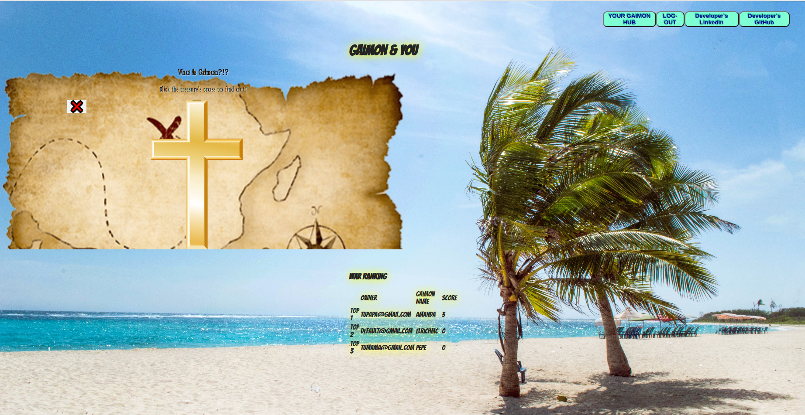

# **What is this Repo for?** 🤔

This repository served as my **learning playground** during my early days of delving into **full-stack web development**. I experimented with foundational web technologies, including **PHP, HTML, CSS, JS,** and **SQL**, building a web system from scratch.

With time, advancements in **AI** such as **ChatGPT** and **Phind** have streamlined the self-learning process, allowing me to grasp new technologies more efficiently. This led me to shift my focus from mastering individual programming languages to understanding the systems themselves.

I have since concentrated on more complex projects like my **full-stack web2 and web3 blockchain IPFS integrated app**: [**BuddyFightersNft**](https://github.com/CarlosAlegreUr/BuddyFighters-FullstackWeb3NFTGame). Though I've moved on from this initial repository, it remains a vital part of my development journey, laying the groundwork for my understanding of full-stack web systems and the main languages that brought them to life.

<hr/>

Here's a **preview** of 2 of the pages:




# The Last README I made

This is the last readme I wrote for this project:

> 🐣 **Note** 🐣: Looking back, this project fills me with **pride** as I reflect on **how much my knowledge has grown**. Who knows, maybe one day I'll come back and finish it. 😄

<hr/>
<hr/>
<hr/>

<a name="readme-top"></a>
<br />

<div align="center">
    

  <h1 align="center">Gaimon & You</h1>
</div>

## About The Project

<div align="center">

</div>
Web page app created using raw classic web development languages.

You can create an account to customize your Gaimon (OnePiece character) and save it in a database!

<hr/>

## Built With

- Front-end: HTML, CSS, JS
- Back-end: PHP, MySQL

<hr/>

## Use Project (Available in the following website)

<div align="center">
<a href="https://github.com/CarlosAlegreUr/GaimonAndYou-FullstackClassicWebApp/tree/serverSideDataBasePart" target="_blank"> <h3> Click to go to Gamon&You 's website app  </h3>  </a> 
</div>

Or clone this repository and run a PHP web server connected to a MySQL database.

```
git clone https://github.com/CarlosAlegreUr/GaimonAndYou-FullstackClassicWebApp.git
```

<hr/>

## Roadmap / TODO section

- CLIENT SIDE:

  - [] HTML:

    - Implement & Undestand basic SEO (search engine optimization).

  - [] CSS:

    - Responsive design CSS
    - Cleaner CSS code, use best practises
    - Add some little animation

  - [] Javascript:
    - Improve best writing practises in code
    - Use more async functions

- SERVER SIDE:

  - [] Program DataBase interaction
    - Sign-up
    - Log-in
    - Save your Gaimon

- STRUCTURE OF PROJECT'S CODE:

  - [] Improve sustainability of the code

- BATTLE MECHANIC!!

<hr/>

## License

Distributed under the MIT License. See `LICENSE.txt` for more information.

<hr/>

## Contact

Carlos Alegre - calegreu@gmail.com

Other Projects: [CarlosAlegreUr's Github](https://github.com/CarlosAlegreUr)

Linked-In: [CarlosAlegreUr's Linked-In](https://www.linkedin.com/in/carlos-alegre-urquiz%C3%BA-0b19701b3/)

<p align="right">(<a href="#readme-top">back to top</a>)</p>
